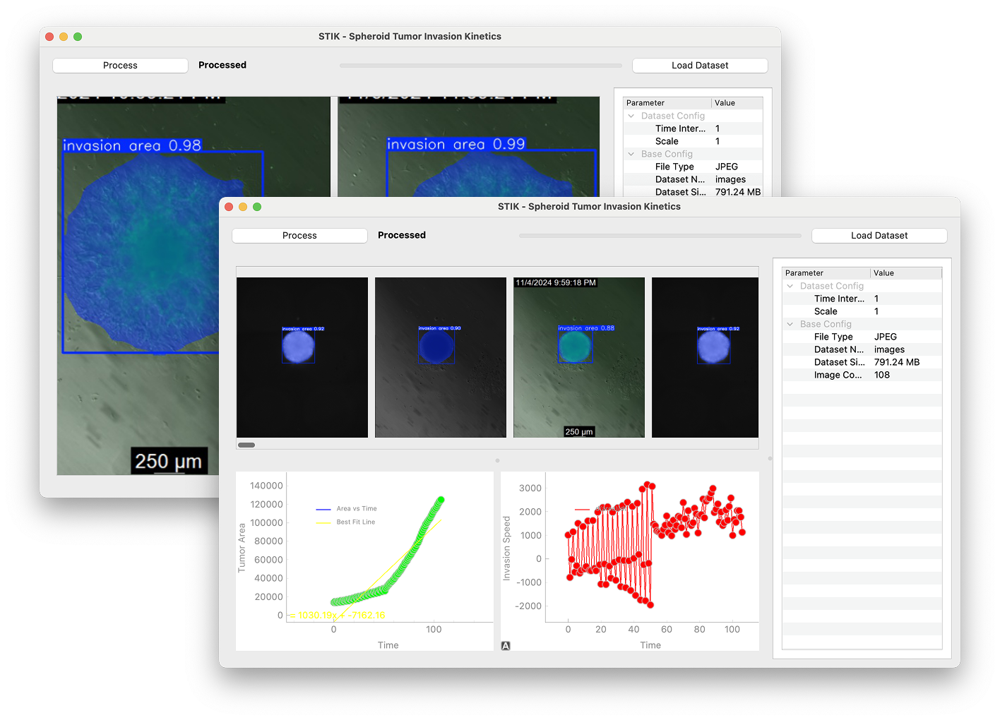
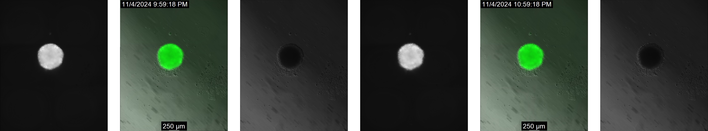
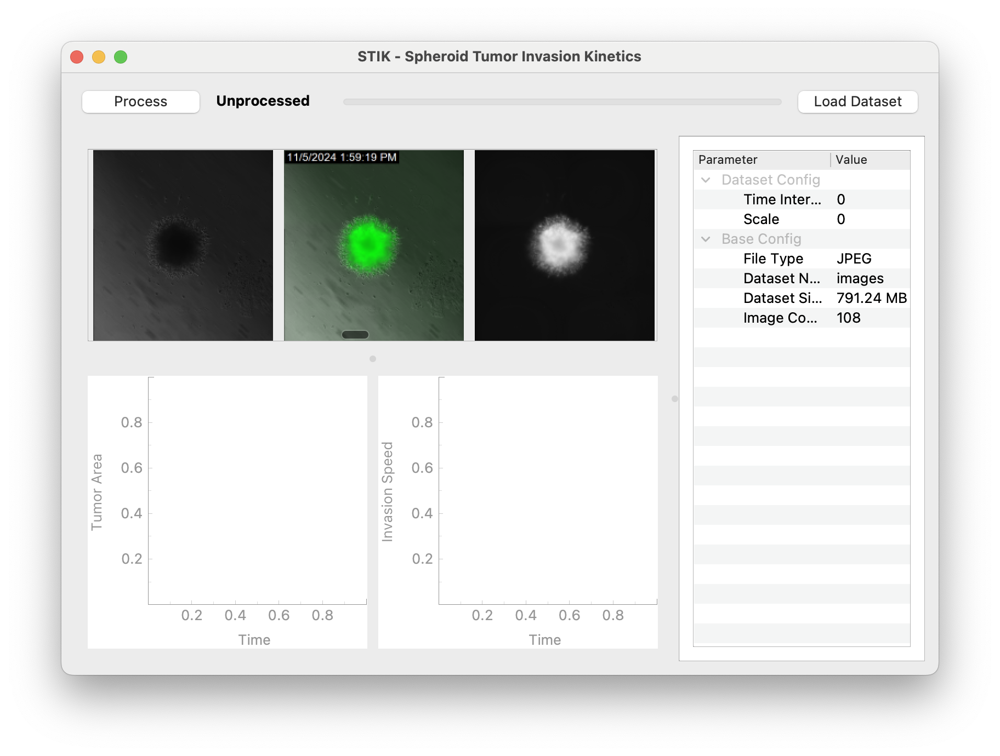
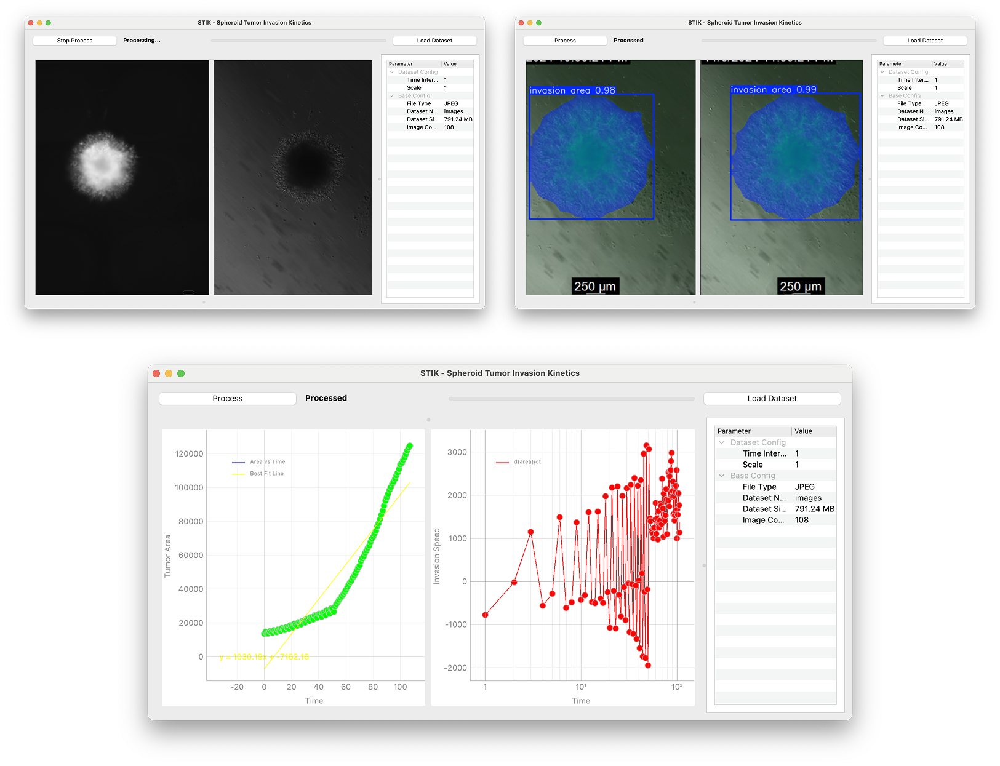

<!-- Improved compatibility of back to top link: See: https://github.com/othneildrew/Best-README-Template/pull/73 -->

<!-- PROJECT LOGO -->
 

<h3 align="center">STIK - Spheriod Tumor Invasion Kinetics GUI</h3>

  

    An AI-powered tool for tracking and predicting spheroid tumor invasion kinetics that eliminates the need for manual tracing, featuring an intuitive graphical user interface. 
     
     
    <a href="https://github.com/sonnyloweus/STIK_GUI"><strong>Github Repo »</strong></a>
     
     
    <a href="https://github.com/ellielin23">Ellie Lin</a>
    &middot;
    <a href="https://github.com/sonnyloweus">Sonny Lowe</a>
  

<!-- ABOUT THE PROJECT -->
## About The Project

### Inspiration
Last summer one of our teammates worked in a lab studying glioblastoma, an aggressive strain of brain cancer. The project involved knocking out genes of interest to better characterize tumor invasion patterns at a molecular level. Such a project necessitated a copious amount of data; the lab produced well-plates upon well-plates of treated cells and subsequent images, all of which required tiresome analysis involving manual hand tracing the images and lots of coffee. It was the kind of work for an unassuming undergrad. Thus, our teammate traced hundreds of photos on an unreliable, finicky platform. Somewhere in between image number 250 and 255, our teammate thought: no way this can't be automated.

### What it does
**STIK_GUI** (Spheroid Tumor Invasion Kinetics GUI) is an AI-powered tool designed to automate the tracking and prediction of tumor spheroid invasion. Instead of manually tracing hundreds of images, researchers can upload their data and let STIK_GUI handle **segmentation, analysis, and visualization**. The intuitive graphical interface makes it easy to process well plate images, extract invasion kinetics, and generate meaningful insights—saving time and reducing human error.

### How we Built it
STIK is developed using PyQt, a set of Python bindings for the Qt application framework, which enables the creation of a **robust and interactive graphical user interface (GUI)**. This user-friendly interface allows researchers to seamlessly import datasets, visualize segmentation results, and analyze generated plots with ease.  

The platform leverages **instance segmentation through the CVAT** (Computer Vision Annotation Tool) framework, providing precise image annotation and labeling. For model training, STIK utilizes **YOLOv8** for both segmentation and bounding box detection, ensuring high accuracy and You-Only-Look-Once speed in identifying and delineating objects.  

With a best precision of 99.739% and a mean Average Precision (mAP50-90) of 97.369%, STIK delivers state-of-the-art segmentation performance, making it an invaluable tool for researchers working with complex image datasets.

Moreover, STIK utilizes **multi-threading in PyQt**, leveraging its signals and slots mechanism to efficiently manage parallel processing. By running the GUI and the model on separate threads, the platform ensures a smooth and responsive user experience without delays or freezing.

Multi-threading allows the GUI to remain interactive while the model performs computationally intensive tasks, such as loading large datasets, running segmentation models, and generating plots. This separation enhances performance, prevents UI lag, and enables real-time updates using PyQtGraph.

### What's next for Spheroid Tumor Invasion Kinetics (STIK) GUI
The first version of STIK GUI is particularly well suited for spheroid invasion assays, a common wet lab experiment that mimics the 3D environment of human tissue to study how cancer cells invade. Naturally, we are curious to see if we can extend our model beyond spherical subjects to automate invasion patterns in, for example, patient scans, tissue slices/histology data, animal models, etc. From the user interface standpoint, we plan on developing a feature that visualizes the images continuously by displaying invasion patterns in a time-lapse format. Additionally, we aim to expand the data capacity to analyze multiple wells, lanes, or even entire well plates at once. This would enable us to perform sub-comparisons between past and current experimental treatments in real time. We believe that STIK_GUI has the potential and versatility to enhance the efficiency of wet lab analysis pipelines across a range of applications.

## Built With
* [![Python][Python.org]][Python-url]
* [![PyQt][PyQt.org]][PyQt-url]
* [![CVAT][CVAT.org]][CVAT-url]
* [![YOLO][YOLO.ai]][YOLO-url]
* [![Conda][Conda.io]][Conda-url]

[Python.org]: https://img.shields.io/badge/Python-3776AB?style=for-the-badge&logo=python&logoColor=white
[Python-url]: https://www.python.org/

[PyQt.org]: https://img.shields.io/badge/PyQt-41CD52?style=for-the-badge&logo=qt&logoColor=white
[PyQt-url]: https://riverbankcomputing.com/software/pyqt/

[CVAT.org]: https://img.shields.io/badge/CVAT-FF6C37?style=for-the-badge&logo=opencv&logoColor=white
[CVAT-url]: https://cvat.org/

[YOLO.ai]: https://img.shields.io/badge/YOLO-00A4E4?style=for-the-badge&logo=yolo&logoColor=white
[YOLO-url]: https://github.com/ultralytics/yolov5

[Conda.io]: https://img.shields.io/badge/Conda-3FC75B?style=for-the-badge&logo=anaconda&logoColor=white
[Conda-url]: https://docs.conda.io/

(<a href="#readme-top">back to top</a>)
